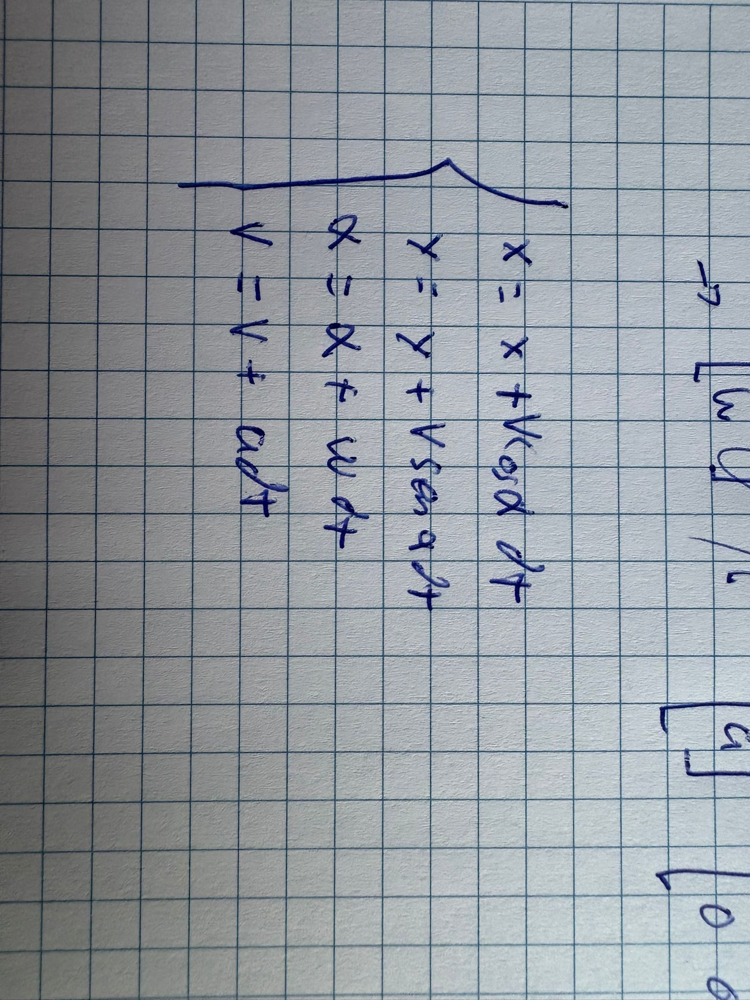
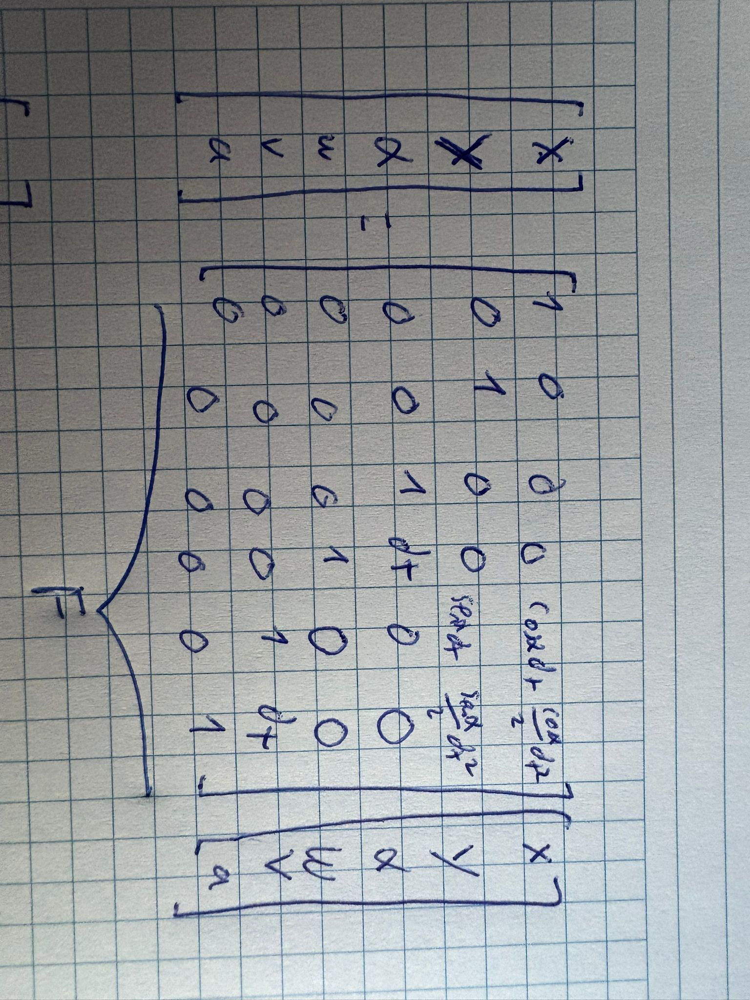
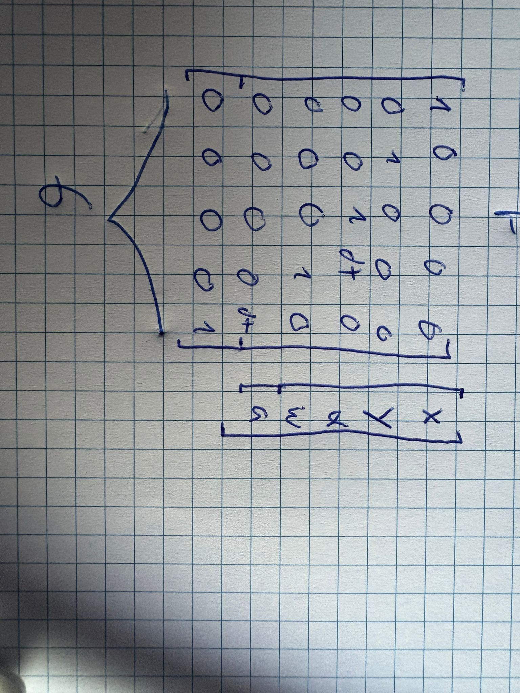

# Kalman Crate

A simple Rust crate that implements a Kalman filter.

## Example

```rust
use kalman_crate::KalmanFilter;
use nalgebra::{SVector, SMatrix};

let mut kf = KalmanFilter::new(
    SVector::from_row_slice(&[0., 0., 0.]),
    &SVector::from_row_slice(&[1e12, 0., 0.]),
    |dt, _s| SMatrix::from_row_slice(&[1.0, dt, 0.5 * dt * dt, 0.0, 1.0, dt, 0.0, 0.0, 1.0]),
    |_dt, _s| SMatrix::identity(),
    1e-10,
);

// You usually do this on a loop
kf.predict(meas, meas_sd, dt);
let state = kf.state();
```

For a complete example check the tests on `src/lib.rs`

# How to use it

First you need to create a filter, it has this parameters
- **Initial state**: A vector with the initial system state  
- **Initial uncertainty**: A vector with the uncertainty of each state value  
- **F**: Function `(dt, state) -> Matrix` that describes state transition  
- **G**: Function `(dt, state) -> Matrix` that describes control input  
- **Variance**: Prediction variance, tweakable to adjust filter behavior  

To get the values of F and G this equation must be followed
next_x = F*x + G*measurement

## Circular motion example
On `src/lib.rs` the test_mcu can be found, it tries to predict the position of a circular motion
The state consists of x, y, angle, rotational_velocity, velocity and acceleration

From this, the following equations can be derived


And from that, the shape of both the matrix F and G can be derived



And those are the values used on the example for F and G
